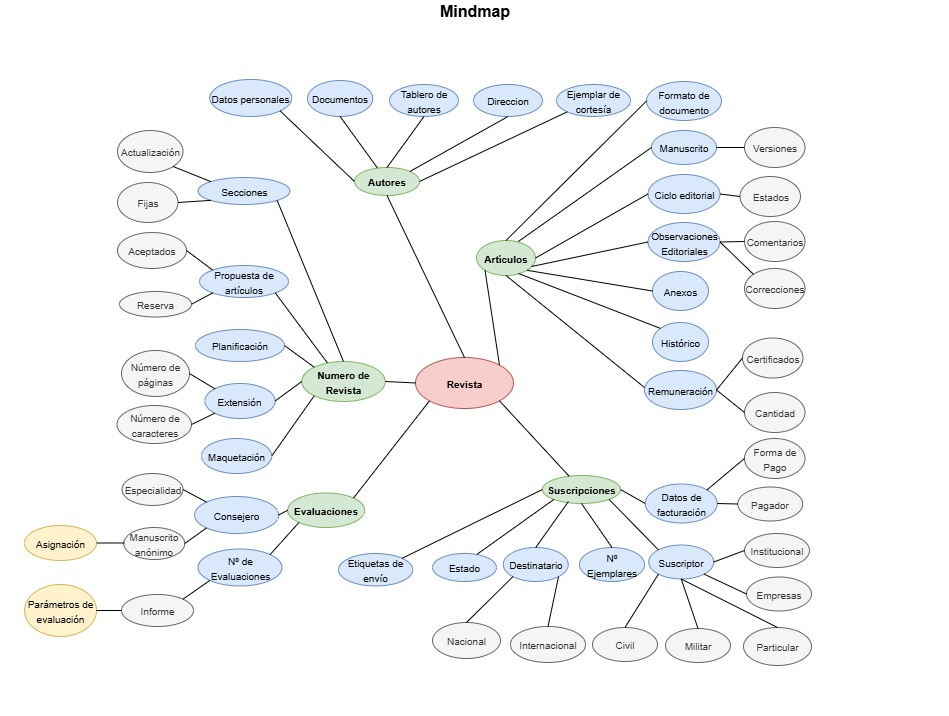

## MindMap

# Desarrollo de Conceptos del Mind Map

Cada concepto tiene una definición sencilla, entendible tanto para negocio como para el equipo técnico

## Autores

* **Datos personales**: información de identificación del autor (nombre, apellidos, contacto, perfil militar si aplica).
* **Documentos**: ficheros obligatorios (DNI, CV) y opcionales (certificados, publicaciones previas).
* **Tablero de autores**: vista personalizada donde el autor puede consultar el estado de sus artículos y observaciones recibidas.
* **Dirección**: domicilio del autor, con posibilidad de marcar dirección principal y de envío postal.
* **Ejemplar de cortesía**: copia gratuita de la revista enviada al autor tras la publicación de un artículo.

---

## Artículos

* **Formato de documento**: tipo de fichero aceptado (manuscrito, PDF, Word, etc.).
* **Manuscrito**: versión enviada del artículo por parte del autor.
* **Versiones**: histórico de manuscritos (v1, v2, v3…), con control de cambios.
* **Ciclo editorial**: fases por las que pasa el artículo (borrador, enviado, en revisión, aceptado, publicado, etc.).
* **Estados**: estados definidos que reflejan el avance del artículo (borrador, en revisión, aceptado, rechazado, publicado).
* **Observaciones editoriales**: comentarios del redactor/editor al autor durante el proceso de revisión.
* **Comentarios**: anotaciones específicas de revisores o editores.
* **Correcciones**: modificaciones sugeridas que debe aplicar el autor en nuevas versiones.
* **Anexos**: ficheros complementarios (imágenes, gráficos, tablas).
* **Histórico**: registro de todas las acciones sobre un artículo (envíos, evaluaciones, decisiones).
* **Remuneración**: pago recibido por los autores según política de la revista.
* **Certificados**: documento que acredita el pago o la publicación de un artículo.

---

## Número de Revista

* **Secciones**: divisiones internas del número (ej. editorial, artículos de investigación, reseñas).
* **Actualización**: modificación de contenidos del número antes de su cierre.
* **Fijas**: secciones permanentes que aparecen en cada edición.
* **Propuesta de artículos**: listado preliminar de artículos candidatos a publicarse en el número.
* **Aceptados**: artículos aprobados para publicarse.
* **Reserva**: artículos aprobados como suplentes en caso de sustitución.
* **Planificación**: calendario previsto de publicación (mes/año).
* **Extensión**: longitud total de la revista o de cada artículo (páginas, caracteres).
* **Número de páginas**: límite máximo de la edición.
* **Número de caracteres**: referencia para ajustar artículos al espacio disponible.
* **Maquetación**: preparación del número para impresión, incluyendo textos, imágenes y diagramación.

---

## Evaluaciones

* **Consejero**: persona experta que revisa y evalúa artículos.
* **Especialidad**: área de conocimiento en la que el consejero puede evaluar.
* **Asignación**: relación formal entre un artículo y uno o más consejeros.
* **Manuscrito anónimo**: versión del artículo en la que se oculta la identidad del autor para evaluación imparcial.
* **Nº de Evaluaciones**: cantidad mínima o máxima de revisiones que debe tener cada artículo.
* **Parámetros de evaluación**: reglas como número de revisores, tiempos de respuesta, formato de informe.
* **Informe**: resultado de la evaluación, con criterios, observaciones y recomendación.

---

## Suscripciones

* **Estado**: situación de la suscripción (activa, suspendida, vencida, cancelada).
* **Destinatario**: persona u organización que recibe la revista (nacional o internacional, civil o militar).
* **Nº de ejemplares**: cantidad de revistas enviadas en cada periodo de publicación.
* **Suscriptor**: entidad contratante (civil, militar, institucional, particular o empresa).
* **Datos de facturación**: información fiscal y bancaria para gestionar pagos.
* **Forma de pago**: métodos admitidos (domiciliación, tarjeta, transferencia, otros).
* **Pagador**: persona o institución que realiza el pago, que puede ser distinta al suscriptor.

---

## Distribución

* **Etiquetas de envío**: documentos generados automáticamente con dirección y datos del destinatario.
* **Nacional**: envío dentro del país.
* **Internacional**: envío fuera del país.
* **Civil**: envío a suscriptores particulares.
* **Militar**: envío a unidades militares o instituciones relacionadas.
* **Institucional**: envío a organizaciones oficiales (ministerios, universidades, etc.).
* **Empresas**: envío a entidades privadas.
* **Particular**: envío a una persona física.

