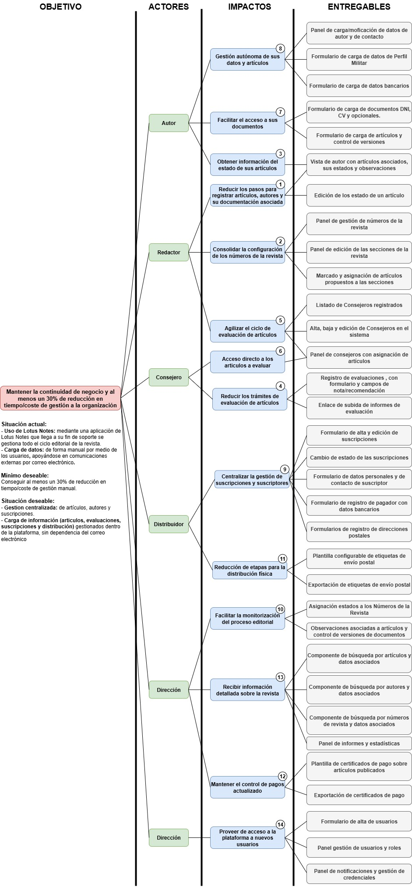

## ImpactMap

# 1. Objetivo Principal

Mantener la **continuidad de negocio con minimización de costes**, asegurando la gestión editorial de artículos, evaluaciones, publicaciones, suscripciones y distribución de ejemplares, mediante la **migración desde Lotus Notes (fin de soporte) a una nueva plataforma** que centralice procesos y reduzca al menos un **30% el tiempo/coste de gestión manual**.

> Acceso al sistema solo si dispone de credenciales DICODEF. En caso contrario, el envío de artículos y documentos se realiza por correo electrónico y el Redactor los integra en la plataforma.

---

# 2. Actores, Impactos y Entregables

## Autor

**8. Gestión autónoma de sus datos y artículos**
*Entregables*

* Panel de carga/modificación de datos de autor y contacto.
* Formulario de carga de documentos (DNI, CV, certificados opcionales).
* Formulario de perfil militar.
* Formulario de datos bancarios.
* Formulario de carga de artículos y control de versiones.

**7. Facilitar el acceso a sus documentos**
*Entregables*

* Vista de autor con artículos asociados y estados.
* Acceso a observaciones editoriales vinculadas.

**3. Obtener información del estado de sus artículos**
*Entregables*

* Consulta de estado de artículos en tiempo real.
* Notificaciones de aceptación, rechazo o revisiones.

---

## Redactor

**1. Reducir los pasos para registrar artículos, autores y su documentación asociada**
*Entregables*

* Registro y modificación de autores con datos, direcciones y documentos.
* Alta de artículos con metadatos, manuscritos y anexos en un mismo flujo.

**2. Consolidar la configuración de los números de la revista**
*Entregables*

* Panel de gestión de números de revista.
* Panel de edición de secciones.
* Marcado y asignación de artículos aceptados o en reserva.

**5. Agilizar el ciclo de evaluación de artículos**
*Entregables*

* Listado y gestión de consejeros.
* Alta/baja/edición de consejeros.
* Asignación de artículos según especialidad.
* Registro de evaluaciones con nota y recomendación.
* Subida de informes de evaluación.

---

## Consejero

**6. Acceso directo a los artículos a evaluar**
*Entregables*

* Panel de consejero con artículos asignados.
* Descarga de manuscritos anonimizados.

**4. Reducir los trámites de evaluación de artículos**
*Entregables*

* Formularios de evaluación estructurados.
* Campos de nota/recomendación.
* Subida de informes complementarios.
* Control de plazos y recordatorios automáticos.

---

## Distribuidor

**9. Centralizar la gestión de suscripciones y suscriptores**
*Entregables*

* Alta, edición y baja de suscriptores.
* Asociación de suscripciones con fechas, estados y nº ejemplares.
* Registro de pagadores y métodos de pago con control de IVA.
* Formularios de direcciones postales.

**11. Reducción de etapas para la distribución física**
*Entregables*

* Configuración de distribución de ejemplares.
* Plantilla configurable de etiquetas de envío.
* Exportación de etiquetas de envío postal (PDF/XLS).

---

## Dirección

**10. Facilitar la monitorización del proceso editorial**
*Entregables*

* Panel de control con estados de artículos y números de revista.
* Observaciones asociadas y control de versiones.
* Historial de artículos y autores.

**13. Recibir información detallada sobre la revista**
*Entregables*

* Búsquedas avanzadas por artículos, autores, consejeros, suscriptores o números.
* Panel de informes y estadísticas estratégicas.

**12. Mantener el control de pagos actualizado**
*Entregables*

* Plantilla de certificados de pago a autores.
* Exportación de certificados en PDF/XLS.

---

## Administrador del sistema

**14. Proveer de acceso a la plataforma a nuevos usuarios**
*Entregables*

* Formulario de alta de usuarios.
* Panel de gestión de usuarios y roles.
* Panel de notificaciones y recuperación de credenciales.

---

