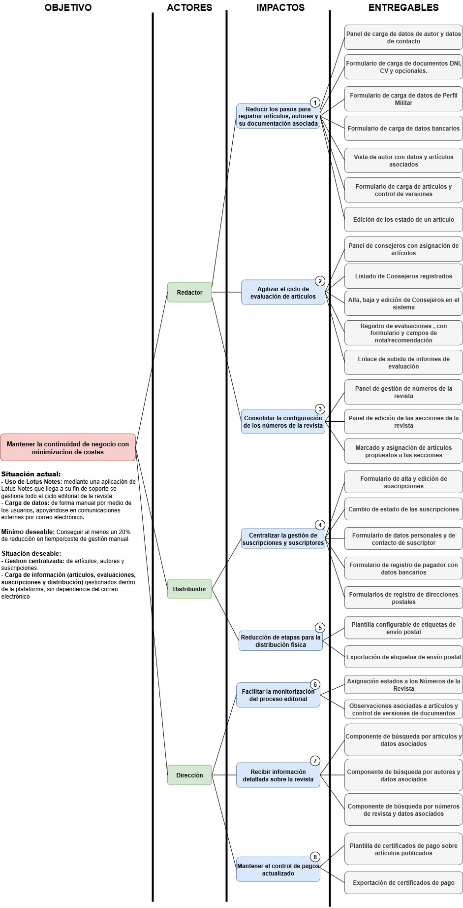

## ImpactMap

## 1. Objetivo Principal

Mantener la **continuidad de negocio con minimización de costes**, asegurando la gestión editorial de artículos, evaluaciones, publicaciones y envíos a suscriptores, mediante la migración desde Lotus Notes (fin de soporte) a una nueva plataforma.

---

## 2. Actores, Impactos y Entregables

### Editor

1. **Reducir los pasos para registrar artículos, autores y su documentación asociada**

   * **Entregables**

     * Registro y modificación de autores con datos, direcciones y documentos (DNI, CV, certificados).
     * Alta de artículos con metadatos, manuscritos y anexos en un mismo flujo.

2. **Agilizar el ciclo de evaluación de artículos**

   * **Entregables**

     * Listado y gestión de consejeros, con asignación de artículos según especialidad.
     * Panel del consejero con acceso a manuscritos, formularios de evaluación y plazos.
     * Registro de evaluaciones e informes adjuntos.

3. **Consolidar la configuración de los números de la revista**

   * **Entregables**

     * Gestión de números de revista con artículos aceptados y de reserva.
     * Clasificación de artículos por temática, sección y tipo.
     * Validación automática de criterios editoriales (extensión en páginas y caracteres).

---

### Distribuidor

4. **Centralizar la gestión de suscripciones y suscriptores**

   * **Entregables**

     * Alta, edición y baja de suscriptores (particulares, militares, institucionales, etc).
     * Asociación de suscriptores a suscripciones con fechas, estados y número de ejemplares.
     * Registro de pagadores y métodos de pago con control de IVA.

5. **Reducir etapas para la distribución física**

   * **Entregables**

     * Configuración de distribución de ejemplares por suscriptor.
     * Generación automática de etiquetas de envío listas para impresión.

---

### Dirección

6. **Facilitar la monitorización del proceso editorial**

   * **Entregables**

     * Panel de control con estados de artículos y números de revista.
     * Historiales de artículos y autores.

7. **Recibir información detallada sobre la revista**

   * **Entregables**

     * Búsquedas avanzadas por artículo, autor, consejero, suscriptor o número de revista.

8. **Generar documentación oficial (certificados y pagos)**

   * **Entregables**

     * Certificados de pago a autores por artículos publicados.

