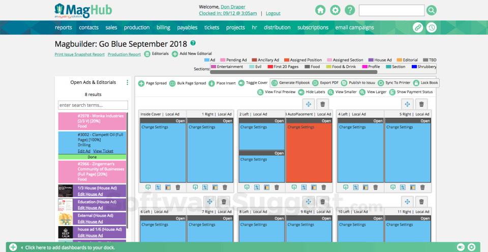
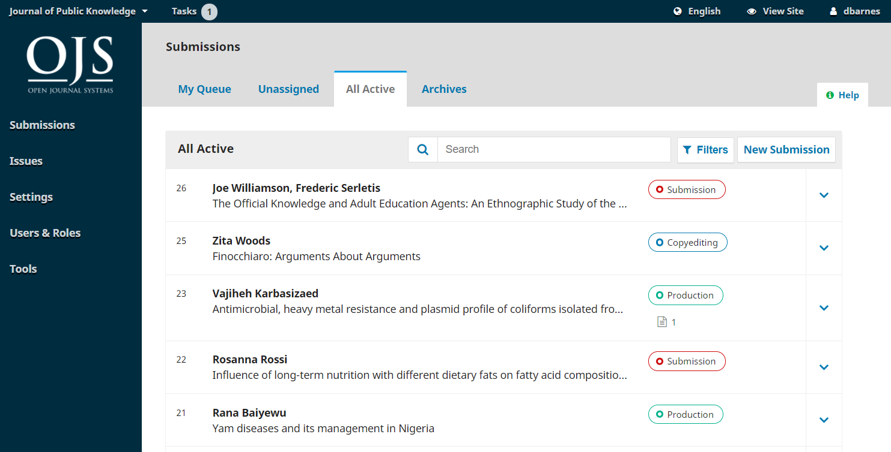
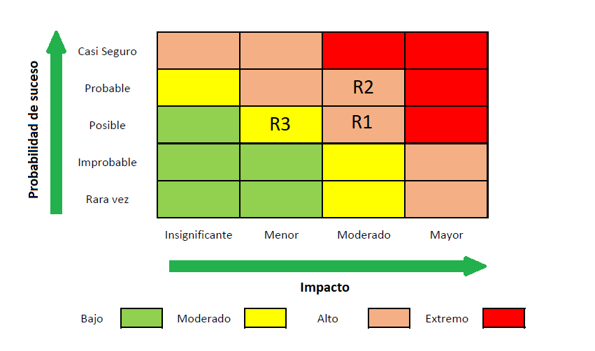
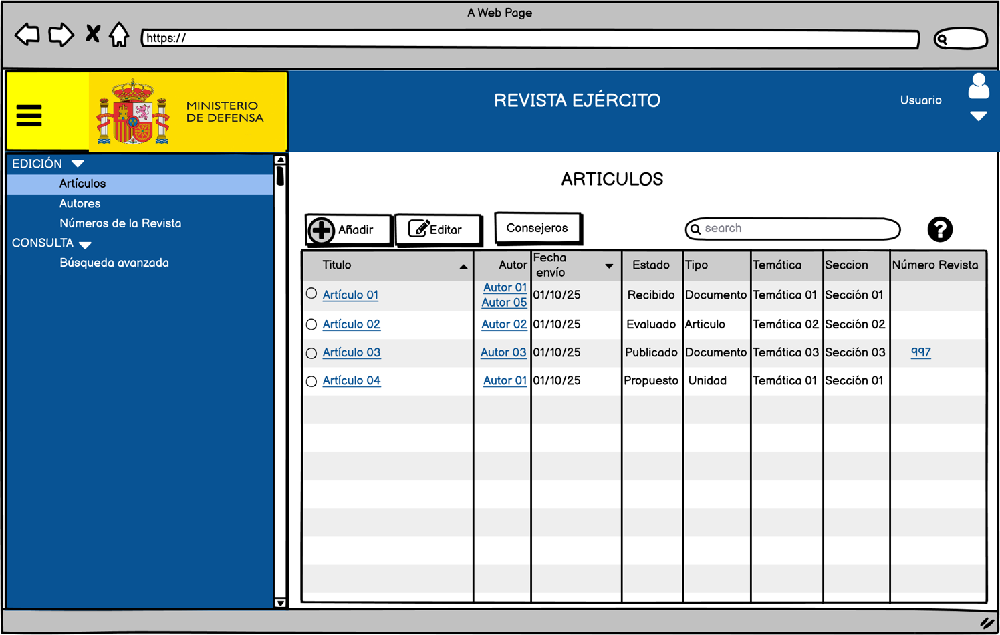

## 1. MagHub (Comercial)

Plataforma SaaS especializada en la gestión de **editoriales y revistas**, que cubre suscripciones, publicidad, distribución y reporting. Orientada a medios profesionales.

* **Tipo de licencia**: Propietaria, modelo SaaS (cloud).
* **Costes**:

  * Licencia a partir de **500–1.000 €/mes** (según número de usuarios).
  * Consultoría e implantación inicial de pago.
  * Costes adicionales por módulos avanzados (ej. publicidad).
* **Tiempo de despliegue**: 1–2 meses (dependiendo de la migración de datos).
* **Usabilidad**: Interfaz pensada para equipos editoriales. Baja curva de aprendizaje.

* **Funcionalidades**:

  * Gestión de suscripciones y distribución.
  * CRM integrado para gestión de clientes y anunciantes.
  * Facturación y pagos online.
  * Módulos de publicidad, inventario e informes.
* **Contras**:

  * Alto coste recurrente.
  * Funcionalidades orientadas a medios comerciales, no tanto a revistas institucionales/militares.
  * Dependencia de un proveedor único.
* **Riesgos**:

  * R1: Incrementos de tarifas.
  * R2: Dependencia tecnológica del SaaS.
  * R3: Riesgo de desajuste entre necesidades específicas y las funcionalidades predefinidas.

**Matriz de riesgos**:

* R1 → Probable / Impacto Alto
* R2 → Posible / Impacto Alto
* R3 → Posible / Impacto Moderado

---

## 2. OJS (Open Journal Systems – Open Source)

Plataforma open source para la gestión y publicación de revistas científicas. Utilizada por instituciones académicas.

* **Tipo de licencia**: Open Source (GPL v2).
* **Costes**:

  * Sin coste de licencia.
  * Costes de hosting propio (\~50–150 €/mes).
  * Soporte opcional por terceros (PKP Publishing Services o consultoras).
* **Tiempo de despliegue**: 1–3 meses con equipo técnico básico.
* **Usabilidad**: Interfaz sencilla. Curva de aprendizaje media.

* **Funcionalidades**:

  * Flujo editorial completo: envío, revisión, publicación online.
  * Gestión de usuarios (autores, revisores, editores).
  * Indexación automática (DOI, CrossRef).
  * Plugins para métricas y estadísticas.
* **Contras**:

  * Limitado para distribución física (orientado a publicación online).
  * Interfaz menos adaptable sin personalización.
  * Requiere soporte técnico si se personaliza.
* **Riesgos**:

  * R1: Dependencia de la comunidad para actualizaciones.
  * R2: Coste añadido en personalizaciones.
  * R3: Falta de soporte oficial salvo servicios contratados.  

**Matriz de riesgos**:

* R1 → Posible / Impacto Moderado
* R2 → Probable / Impacto Alto
* R3 → Posible / Impacto Moderado

---

## 3. Desarrollo Propio (Medusa: Spring Boot + Angular)

Aplicación a medida desarrollada internamente para soportar **gestión editorial y distribución física de la**, cumpliendo con GDPR y necesidades específicas.

* **Tipo de licencia**: Propietaria interna (sin coste de licencias base).
* **Costes**:

  * Coste inicial de desarrollo bajo (equipo de 2–3 desarrolladores, 2 meses).
  * Costes de mantenimiento anuales según recursos internos.
  * Infraestructura en servidores propios ya existentes.
* **Tiempo de despliegue**: 2 meses para MVP funcional.
* **Usabilidad**: Totalmente personalizable. Interfaz Angular + Bootstrap.

* **Funcionalidades**:

  * Gestión completa de artículos, autores, consejeros y evaluaciones.
  * Control de suscripciones, pagadores y distribución física.
  * Exportación de etiquetas en PDF/XLS.
  * Informes básicos con posibilidad de ampliación.
* **Contras**:

  * Dependencia de hosting propio.
  * Necesidad de soporte continuo para ampliación de funcionalidades.
* **Riesgos**:

  * R1: Disponibilidad de la Red Corporativa.
  * R2: Dependencia de un equipo reducido.
  * R3: Riesgo de deuda técnica si no se planifica bien la arquitectura.

**Matriz de riesgos**:

* R1 → Posible / Impacto Alto
* R2 → Posible / Impacto Alto
* R3 → Posible / Impacto Moderado

## Comparativa de Alternativas

| Criterio                  | **MagHub (Comercial)**                                                            | **OJS (Open Source)**                                                                         | **Desarrollo Propio**                                                                      |
| ------------------------- | --------------------------------------------------------------------------------- | --------------------------------------------------------------------------------------------- | ------------------------------------------------------------------------------------------ |
| **Tipo de licencia**      | Propietaria (SaaS)                                                                | Open Source (GPL v2)                                                                          | Propietaria interna                                                                        |
| **Coste inicial**         | Bajo (despliegue + formación)                                                          | Bajo (instalación/hosting)                                                                    | Bajo (desarrollo 2 meses, equipo interno)                                                |
| **Coste recurrente**      | Alto (500–1000 €/mes)                                                             | Bajo (hosting 50–150 €/mes)                                                                   | Nulo (despliegue en la Red Corporativa existente)
| **Tiempo despliegue**     | 1–2 meses                                                                         | 1–3 meses                                                                                     | 2 meses (MVP)                                                                            |
| **Usabilidad**            | Alta, interfaz moderna                                                            | Media, interfaz básica                                                                        | Alta, interfaz totalmente personalizable                                                   |
| **Funcionalidades clave** | Suscripciones, CRM, facturación, publicidad, reporting                            | Gestión editorial, publicación online, revisiones                                        | Gestión completa editorial + distribución física + informes                               |
| **Contras**               | Coste recurrente alto, dependencia proveedor, orientado a medios comerciales      | Limitado para distribución física, personalización costosa, soporte comunitario               | Dependencia de hosting propio + necesidad de soporte continuo para ampliación de funcionalidades            |
| **Riesgos principales**   | R1: Subida de tarifas R2: Dependencia SaaS R3: Desajuste de funcionalidades | R1: Dependencia de comunidad R2: Costes ocultos en personalización R3: Soporte limitado | R1: Disponibilidad de la Red Corporativa R2: Dependencia del equipo R3: Riesgo de deuda técnica |
| **Perfil recomendado**    | Organizaciones con presupuesto alto y orientación comercial                       | Instituciones académicas y científicas con publicación digital                                | Organizaciones que necesitan control total de distribución física y personalización    |

* **MagHub** es adecuado si se prioriza rapidez y soporte comercial, pero a un coste alto.
* **OJS** está indicado para publicaciones digitales académicas, barato pero limitado en distribución física.
* **Desarrollo Propio** es la mejor opción para **integrar distribución física y control absoluto** a menor coste, aprovechando los recursos de la organización.