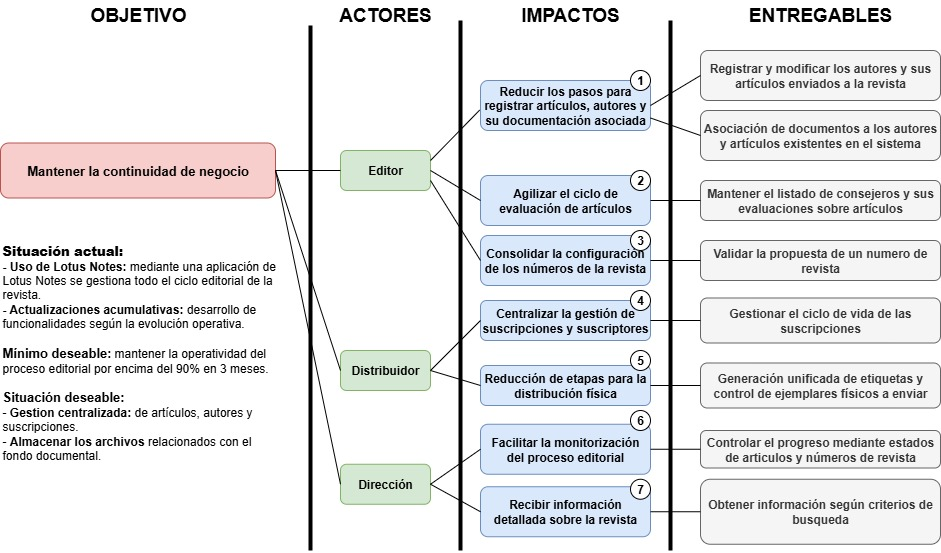

## ImpactMap

## 1. Objetivo Principal

El objetivo mantener la **continuidad de negocio** asegurando gestión editorial de artículos, evaluaciones, publicaciones y envíos a suscriptores.

## 2. Actores y sus Impactos

### Editor

1. **Reducir los pasos para registrar artículos, autores y su documentación asociada**

   * Evitar la disgregación de tareas al centralizar la información de artículos y autores en un único sistema.
   * Permitir que el editor gestione en un solo flujo tanto la autoría como la documentación de soporte (artículos y sus documentos anexos).

2. **Agilizar el ciclo de evaluación de artículos**

   * Mantener un registro de consejeros, sus artúlos asignados y los informes de evaluación realizados.
   * Asignar las evaluaciones realizadas a los articulos, según los parámetros establecidos.

3. **Consolidar la configuración de los números de la revista**

   * Facilitar al editor la agrupación de artículos seleccionados en un nú,ero de revista.
   * Clasificar los artículos por temática, sección de la revista y y tipo, según las directrices editoriales.

---

### Distribuidor

4. **Centralizar la gestión de suscripciones y suscriptores**

   * Centralizar el control de los datos de suscriptores particulares, militares e institucionales.
   * Evitar inconsistencias en renovaciones, bajas o altas en distintos soportes (papel, Excel, correo electrónico).

5. **Reducir etapas para la distribución física**

   * Automatizar la preparación de etiquetas postales y listados de distribución.
   * Minimizar la intervención manual en la organización de envíos, reduciendo tiempos y errores.

---

### Dirección

6. **Facilitar la monitorización del proceso editorial**

   * Acceso rápido al estado de artículos y números de revista en tiempo real.
   * Permitir que dirección visualice cuellos de botella o retrasos en el ciclo editorial.

7. **Recibir información detallada sobre la revista**

   * Obtener información mediante busquedas optimizadas (por autor, número de revista, suscriptor, evaluador, etc).
   * Disponer de datos para decisiones estratégicas, como nuevas ediciones o ajustes en la distribución.

---

## 3. Funcionalidades Clave

### Para Editores

1. **Registrar y modificar los autores y sus artículos enviados a la revista**

   * Formulario único para registrar autores y sus datos de contacto.
   * Funcionalidad para cargar, modificar o eliminar artículos enviados.

2. **Asociación de documentos a los autores y artículos existentes en el sistema**

   * Adjuntar archivos adicionales (anexos, CV, imágenes).
   * Mantener un repositorio organizado vinculado a cada artículo y autor.

3. **Mantener el listado de consejeros y sus evaluaciones sobre artículos**

   * Registro de consejeros con su perfil y áreas de especialización.
   * Asignación de artículos a revisores y almacenamiento de evaluaciones recibidas.

4. **Validar la propuesta de un número de revista**

   * Agrupar artículos seleccionados en un número.
   * Validación automática de criterios editoriales (páginas, secciones, estado de evaluación).

---

### Para Distribuidores

5. **Gestionar el ciclo de vida de las suscripciones**

   * Altas, bajas y renovaciones con trazabilidad completa.
   * Control del tipo de suscripción (particular, militar, institucional).

6. **Generación unificada de etiquetas y control de ejemplares físicos a enviar**

   * Creación automática de etiquetas postales listas para impresión.
   * Gestión de ejemplares por tipo suscripción y destinatario.

---

### Para Dirección

7. **Monitorizar el proceso mediante estados de artículos y números de revista**

   * Visivilidad sobre el estado de cada artículo (recibido, en revisión, aprobado, publicado).
   * Seguimiento de los números de la revista en preparación o ya publicados.

8. **Obtener información según criterios de búsqueda**

   * Búsquedas avanzadas por autor, artículo, edición, estado de suscripción, consejero o periodo temporal.
   * Obtener datos para la facturación de las suscripciones.

